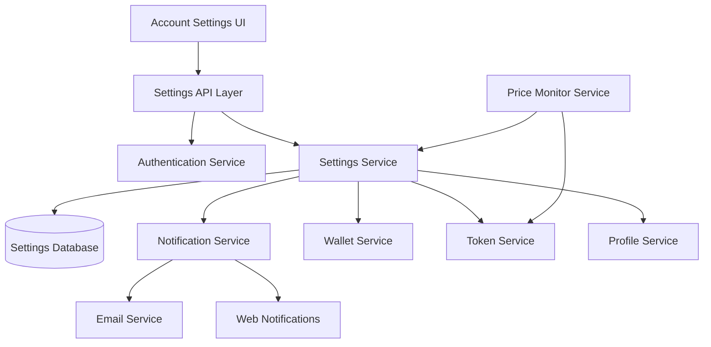

# Account Settings Feature Design

## Overview

The Account Settings feature provides a comprehensive interface for users to manage their fintech application preferences, security settings, and compliance access. The design integrates seamlessly with existing notification, wallet, and token trading systems while maintaining consistency with the current dashboard UI patterns.

The feature is organized into six main sections: Push Notifications, Profile Management, Currency Preferences, Price Alerts, Auto-Lock Wallet, and Compliance. Each section provides intuitive controls that immediately persist changes and integrate with backend services.

## Architecture

### High-Level Architecture



### Component Architecture

The Account Settings feature follows a modular component architecture:

- **SettingsContainer**: Main container component managing state and API calls
- **SettingsSection**: Reusable section wrapper with consistent styling
- **NotificationSettings**: Toggle controls for notification preferences
- **ProfileSettings**: Profile display and editing interface
### Currency Preferences with Live Conversion

Users can select their preferred currency for displaying prices and balances throughout the application with real-time exchange rate conversion. The system supports:

- **NGN (Nigerian Naira)**: Default currency for Nigerian users
- **USD (US Dollar)**: For international users with live conversion

The currency preference is stored in the user settings and applied across all financial displays including:
- Token prices
- Wallet balances
- Transaction amounts
- Yield payouts
- Volume metrics
- Portfolio values

#### Live Currency Conversion Implementation

**Exchange Rate API**: ExchangeRate-API (https://api.exchangerate-api.com)
- ✅ **Completely free** - No signup, no API key, no costs
- ✅ **Reliable** - Trusted exchange rate data source
- ✅ **No rate limits** - Free tier allows reasonable use
- ✅ **Simple API** - Easy integration with JSON responses
- ✅ **Supports NGN** - Direct NGN to USD conversion

**API Service**: `src/lib/currency-converter.ts`
- Fetches live exchange rates from ExchangeRate-API
- Caches rates for 1 hour to optimize performance
- Provides fallback rate (0.0012) if API is unavailable
- Supports bidirectional conversion (NGN ↔ USD)
- Exports utility functions: `convertNGNtoUSD()`, `convertUSDtoNGN()`, `formatCurrency()`

**API Endpoint**: `/api/currency/exchange-rate`
- Returns current NGN to USD rate
- Includes last updated timestamp
- Cached response for 1 hour
- Format: `{ rate: 0.0012, lastUpdated: "2026-01-20T00:00:00Z", displayRate: "1 NGN = $0.0012 USD" }`

**React Hook**: `useCurrency(defaultCurrency)`
- Manages currency preference state
- Automatically fetches and refreshes exchange rates
- Provides `convertAmount(amountInNGN)` utility
- Provides `formatAmount(amountInNGN)` utility
- Refreshes rate every hour automatically
- Returns: `{ currency, exchangeRate, loading, error, setCurrency, convertAmount, formatAmount }`

**Usage Example**:
```typescript
const { currency, formatAmount, setCurrency, exchangeRate } = useCurrency('NGN')

// Display price in user's preferred currency
<div>{formatAmount(1500)}</div> 
// Shows "₦1,500" if NGN or "$1.80" if USD

// Show exchange rate info
<div>1 NGN = ${exchangeRate?.rate.toFixed(4)} USD</div>
<div>Last updated: {exchangeRate?.lastUpdated}</div>

// Change currency preference
<button onClick={() => setCurrency('USD')}>Switch to USD</button>
```

**Conversion Flow**:
1. All data stored in database in NGN (base currency)
2. When user selects USD, fetch current exchange rate
3. Convert NGN amounts to USD on display: `usdAmount = ngnAmount × rate`
4. Format with appropriate symbol and decimals
5. Cache rate for 1 hour, reuse for all conversions

**Performance Optimization**:
- **Server-side caching**: Exchange rate cached for 1 hour using Next.js revalidation
- **Client-side caching**: Hook caches rate in state, refreshes hourly
- **Shared cache**: All users share same cached rate
- **Result**: Minimal API calls, fast conversions, no delays

**Error Handling**:
- If API fails: Use fallback rate (0.0012 USD per NGN)
- If network error: Show last cached rate
- If no cache: Display NGN only with error message
- Graceful degradation: App remains functional

**Display Formatting**:
- **NGN**: Whole numbers with comma separators (₦1,500)
- **USD**: Two decimal places with comma separators ($1.80)
- **Large numbers**: K/M/B suffixes with hover tooltip showing full value

**API Details**:
- **Endpoint**: `https://api.exchangerate-api.com/v4/latest/NGN`
- **Response**: `{ base: "NGN", date: "2026-01-20", rates: { USD: 0.0012, ... } }`
- **Update frequency**: Daily updates
- **Reliability**: High uptime
- **Cost**: $0 forever (free tier)
- **PriceAlertSettings**: Price alert configuration interface
- **SecuritySettings**: Auto-lock and security preferences
- **ComplianceSection**: Legal document access interface

### Integration Points

The design integrates with existing systems through well-defined interfaces:

1. **Notification Service Integration**: Extends the existing `src/lib/notifications.ts` system
2. **Authentication**: Uses NextAuth session management for security
3. **Database**: Extends Prisma schema with new settings tables
4. **UI Consistency**: Follows existing dashboard component patterns from `DashboardContainer.tsx`

## Components and Interfaces

### Core Data Models

```typescript
interface UserSettings {
  id: string
  userId: string
  notificationPreferences: NotificationPreferences
  currencyPreference: 'USD' | 'NGN'
  priceAlertSettings: PriceAlertSettings
  autoLockEnabled: boolean
  createdAt: Date
  updatedAt: Date
}

interface ExchangeRateData {
  rate: number              // Current NGN to USD rate (e.g., 0.0012)
  lastUpdated: string       // ISO timestamp of last rate fetch
  displayRate: string       // Human-readable format (e.g., "1 NGN = $0.0012 USD")
}

interface CurrencyConversion {
  fromCurrency: 'NGN' | 'USD'
  toCurrency: 'NGN' | 'USD'
  amount: number
  convertedAmount: number
  rate: number
  timestamp: Date
}

interface NotificationPreferences {
  email: {
    transactions: boolean
    walletFunding: boolean
    withdrawals: boolean
    tokenPurchases: boolean
    tokenSales: boolean
    priceAlerts: boolean
    securityAlerts: boolean
  }
  webApp: {
    transactions: boolean
    walletFunding: boolean
    withdrawals: boolean
    tokenPurchases: boolean
    tokenSales: boolean
    priceAlerts: boolean
    securityAlerts: boolean
  }
}

interface PriceAlertSettings {
  enabled: boolean
  thresholdPercentage: number
  watchedTokens: string[]
}

interface ProfileUpdateData {
  username?: string
  email?: string
  firstName?: string
  lastName?: string
}
```

### API Interfaces

```typescript
// Settings API endpoints
interface SettingsAPI {
  GET /api/settings: GetUserSettings
  PUT /api/settings/notifications: UpdateNotificationPreferences
  PUT /api/settings/currency: UpdateCurrencyPreference
  PUT /api/settings/price-alerts: UpdatePriceAlertSettings
  PUT /api/settings/auto-lock: UpdateAutoLockSetting
  PUT /api/settings/profile: UpdateProfileData
  GET /api/currency/exchange-rate: GetExchangeRate
}

// Response types
interface GetUserSettingsResponse {
  success: boolean
  data: UserSettings
}

interface GetExchangeRateResponse {
  success: boolean
  data: {
    base: 'NGN'
    target: 'USD'
    rate: number
    lastUpdated: string
    displayRate: string
  }
}

interface UpdateSettingsResponse {
  success: boolean
  message: string
  data?: Partial<UserSettings>
}
```

### Component Interfaces

```typescript
interface SettingsSectionProps {
  title: string
  description?: string
  children: React.ReactNode
  className?: string
}

interface ToggleControlProps {
  label: string
  description?: string
  checked: boolean
  onChange: (checked: boolean) => void
  disabled?: boolean
}

interface CurrencySelectProps {
  value: 'USD' | 'NGN'
  onChange: (currency: 'USD' | 'NGN') => void
  userLocation?: string
}
```

## Data Models

### Database Schema Extensions

```sql
-- User Settings table
CREATE TABLE user_settings (
  id VARCHAR(36) PRIMARY KEY,
  user_id VARCHAR(36) NOT NULL UNIQUE,
  notification_preferences JSON NOT NULL,
  currency_preference ENUM('USD', 'NGN') DEFAULT 'NGN',
  price_alert_settings JSON NOT NULL,
  auto_lock_enabled BOOLEAN DEFAULT true,
  created_at TIMESTAMP DEFAULT CURRENT_TIMESTAMP,
  updated_at TIMESTAMP DEFAULT CURRENT_TIMESTAMP ON UPDATE CURRENT_TIMESTAMP,
  FOREIGN KEY (user_id) REFERENCES users(id) ON DELETE CASCADE
);

-- Price Alert Configurations
CREATE TABLE price_alerts (
  id VARCHAR(36) PRIMARY KEY,
  user_id VARCHAR(36) NOT NULL,
  token_symbol VARCHAR(10) NOT NULL,
  threshold_percentage DECIMAL(5,2) NOT NULL DEFAULT 5.00,
  is_active BOOLEAN DEFAULT true,
  last_triggered_at TIMESTAMP NULL,
  created_at TIMESTAMP DEFAULT CURRENT_TIMESTAMP,
  FOREIGN KEY (user_id) REFERENCES users(id) ON DELETE CASCADE,
  INDEX idx_user_token (user_id, token_symbol),
  INDEX idx_active_alerts (is_active, token_symbol)
);

-- Settings Audit Log
CREATE TABLE settings_audit_log (
  id VARCHAR(36) PRIMARY KEY,
  user_id VARCHAR(36) NOT NULL,
  setting_type VARCHAR(50) NOT NULL,
  old_value JSON,
  new_value JSON,
  ip_address VARCHAR(45),
  user_agent TEXT,
  created_at TIMESTAMP DEFAULT CURRENT_TIMESTAMP,
  FOREIGN KEY (user_id) REFERENCES users(id) ON DELETE CASCADE,
  INDEX idx_user_audit (user_id, created_at)
);
```

### Notification Service Extensions

```typescript
// Extended notification types
type ExtendedNotificationType = 
  | 'transaction' 
  | 'alert' 
  | 'price_alert' 
  | 'security' 
  | 'system'

interface NotificationChannel {
  email: boolean
  webApp: boolean
  push?: boolean // Future extension
}

interface NotificationRule {
  type: ExtendedNotificationType
  subtype: string
  channels: NotificationChannel
  enabled: boolean
}
```

## Correctness Properties

*A property is a characteristic or behavior that should hold true across all valid executions of a system—essentially, a formal statement about what the system should do. Properties serve as the bridge between human-readable specifications and machine-verifiable correctness guarantees.*

Before defining the correctness properties, I need to analyze the acceptance criteria to determine which ones are testable as properties, examples, or edge cases.
